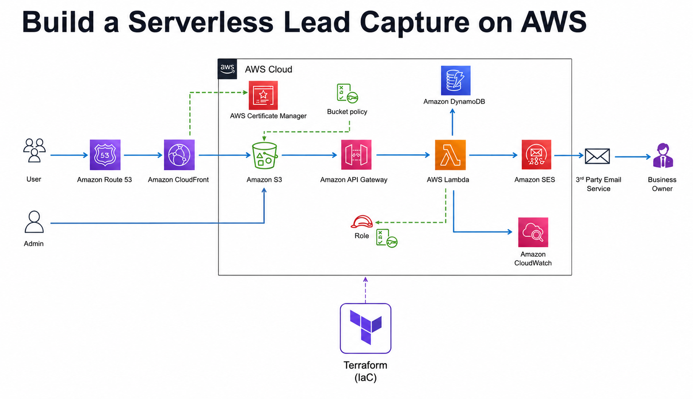

# Serverless Ebook Funnel on AWS

A serverless ebook landing page with a fully functional lead capture system built on AWS. Users visit the site, submit a contact form, and their details are emailed to the business owner and stored in a database — all without managing a single server.



---

## Architecture

The system is split into two flows:

**User flow (blue arrows)**
```
User → Route 53 → CloudFront → S3 → API Gateway → Lambda → SES → Business Owner
                                                         ↓
                                                     DynamoDB
                                                     CloudWatch
```

**Admin flow**
```
Admin → S3 (direct file upload / sync)
```

### AWS Services Used

| Service | Role |
|---|---|
| **Amazon Route 53** | DNS routing — maps your custom domain to CloudFront |
| **Amazon CloudFront** | Global CDN — serves the static site with low latency over HTTPS |
| **AWS Certificate Manager** | Issues and manages the SSL/TLS certificate for your domain |
| **Amazon S3** | Hosts the static website files; protected by a bucket policy |
| **Amazon API Gateway** | Exposes a REST API endpoint that the contact form POSTs to |
| **AWS Lambda** | Processes form submissions — writes to DynamoDB and sends email via SES |
| **IAM Role** | Grants Lambda least-privilege access to DynamoDB, SES, and CloudWatch |
| **Amazon DynamoDB** | Stores every lead submission (`ContactMessages` table) |
| **Amazon SES** | Sends the lead notification email to the business owner |
| **Amazon CloudWatch** | Captures Lambda logs for monitoring and debugging |

---

## Project Structure

```
├── index.html                            ← landing page with contact form
├── 404.html                              ← custom error page
├── css/
│   └── templatemo-ebook-landing.css      ← main stylesheet
├── js/                                   ← form submission script (fetch → API Gateway)
├── fonts/
├── images/
├── project-diagram.png                   ← architecture diagram
└── README.md
```

---

## Deployment

### Phase 1 — Static Website

1. **Create an S3 bucket** and enable static website hosting.
   ```bash
   aws s3 mb s3://your-bucket-name
   ```

2. **Apply a bucket policy** to allow public read access.
   ```json
   {
     "Version": "2012-10-17",
     "Statement": [{
       "Sid": "PublicReadGetObject",
       "Effect": "Allow",
       "Principal": "*",
       "Action": "s3:GetObject",
       "Resource": "arn:aws:s3:::your-bucket-name/*"
     }]
   }
   ```

3. **Sync files to S3.**
   ```bash
   aws s3 sync . s3://your-bucket-name
   ```

4. **Request a public SSL certificate** in AWS Certificate Manager (must be in `us-east-1` for CloudFront).

5. **Create a CloudFront distribution** pointing to your S3 bucket. Attach the ACM certificate.

6. **Configure Route 53** with an A record (alias) pointing your domain to the CloudFront distribution.

---

### Phase 2 — Contact Form Backend

1. **Verify sender and receiver emails** in Amazon SES (required while SES is in sandbox mode).

2. **Create an IAM policy** (`Epicreads_SES_policy`) granting Lambda permissions to write CloudWatch logs and send email via SES.

3. **Create an IAM role** (`Epicreads_role`) and attach the policy. Lambda will assume this role.

4. **Create a Lambda function** (`epicreads_contactus`) using Node.js 18.x with ES module type. Paste the function code and set the role above.

5. **Create a REST API** in API Gateway (`EpicReads_api`):
   - Create a resource (`epicreads_resource`)
   - Add a POST method backed by the Lambda function
   - Enable CORS
   - Deploy to a stage (e.g. `prod`)

6. **Update `index.html`** — replace the API URL constant in the `<script>` block with your deployed API Gateway endpoint.

7. **Sync updated files to S3.**
   ```bash
   aws s3 sync . s3://your-bucket-name
   ```

---

### Phase 3 — Lead Storage (DynamoDB)

1. **Create the DynamoDB table.**
   ```bash
   aws dynamodb create-table \
     --table-name ContactMessages \
     --attribute-definitions AttributeName=id,AttributeType=S \
     --key-schema AttributeName=id,KeyType=HASH \
     --billing-mode PAY_PER_REQUEST \
     --region us-east-1
   ```

2. **Add an inline IAM policy** (`LambdaContact-DdbWrite`) to the Lambda role.
   ```json
   {
     "Version": "2012-10-17",
     "Statement": [{
       "Effect": "Allow",
       "Action": ["dynamodb:PutItem"],
       "Resource": "arn:aws:dynamodb:us-east-1:*:table/ContactMessages"
     }]
   }
   ```

3. **Update the Lambda function** with the Phase 3 code that writes to DynamoDB before sending the SES email.

4. **Deploy and verify** — submit the form, then check the `ContactMessages` table in the DynamoDB console and the Lambda logs in CloudWatch.

---


## License & Attribution

- HTML template by [TemplateMo](https://templatemo.com). Keep footer attribution as required by the template license.
- AWS architecture designed for educational purposes.
# serverless-ebook-funnel
